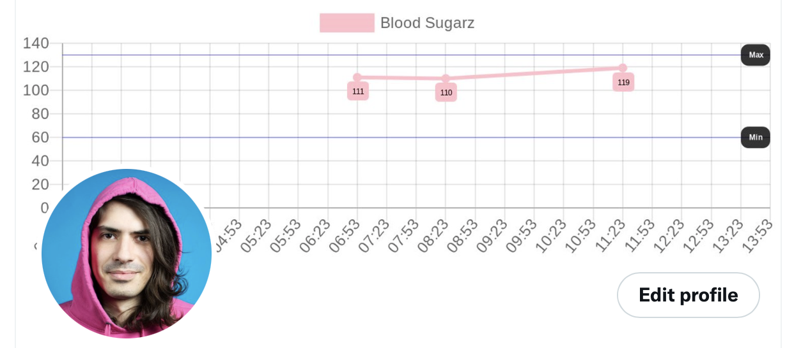

# Contour 2 Twitter

Contour readings to Twitter profile banner:



## Run

Download the CSV from from glucocontro.online, parse it, and update the Twitter profile banner:

```bash
# Install node
npm install

CONTOUR_EMAIL='...' \
CONTOUR_PASSWORD='...' \
TWITTER_APP_KEY='...' \
TWITTER_APP_SECRET='...' \
TWITTER_ACCESS_TOKEN='...' \
TWITTER_ACCESS_SECRET='...' \
npx cypress run
```
