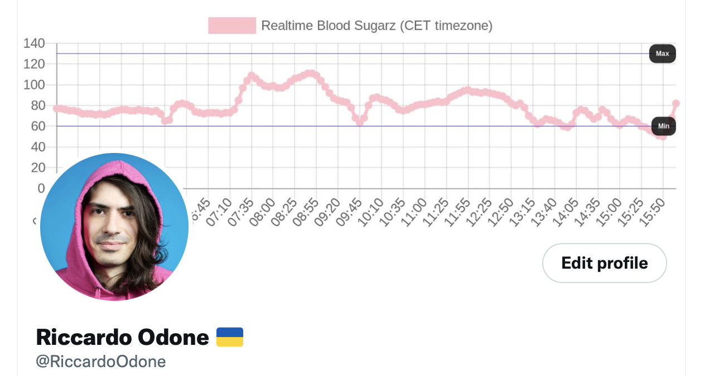

# Dexcom 2 Twitter

Dexcom readings to Twitter profile banner:



## Run

```bash
# Install node
npm install --global yarn
yarn install

# Fetch Dexcom readings and update the Twitter profile banner..

# ..once
DEXCOM_EMAIL='...' \
DEXCOM_PASSWORD='...' \
TWITTER_APP_KEY='...' \
TWITTER_APP_SECRET='...' \
TWITTER_ACCESS_TOKEN='...' \
TWITTER_ACCESS_SECRET='...' \
yarn once

# ..when index.ts gets saved
DEXCOM_EMAIL='...' \
DEXCOM_PASSWORD='...' \
TWITTER_APP_KEY='...' \
TWITTER_APP_SECRET='...' \
TWITTER_ACCESS_TOKEN='...' \
TWITTER_ACCESS_SECRET='...' \
yarn watch
```

## Inspiration

The [Dexcom API is not available outside of the US](https://developer.dexcom.com/content/frequently-asked-questions) so I needed to use some undocumented APIs. This time I didn't copy from StackOverflow but from the work of other T1D developers:
- https://gist.github.com/StephenBlackWasAlreadyTaken/adb0525344bedade1e25
- https://github.com/nightscout/share2nightscout-bridge/blob/976fce416140d9b4b1e43d3704d4c0778ab57064/index.js#L166
- https://www.hanselman.com/blog/bridging-dexcom-share-cgm-receivers-and-nightscout
- https://github.com/aud/dexcom-share-api/blob/main/src/index.ts
